# 🎮 Group Project: Game Collection

## 📚 Table of Contents

1. [Overview](#overview)
2. [Games](#games)
    - [Game 1: Pac-Man in Space! - Developed my Blaise](#game-1-pac-man-in-space)
    - [Game 2: Space Invaders - Developed by Rhys](#game-2-space-invaders)
    - [Game 3: Mini Crash - Developed by Hans](#game-3-mini-crash)
3. [Team Collaboration](#team-collaboration)
4. [Deployment & Setup](#deployment--setup)
5. [Testing](#testing)
6. [Project Structure](#project-structure)
7. [Timeline](#timeline)
8. [Future Plans](#future-plans)

---

## Overview

About The Project  
This group project is a collection of three retro-inspired arcade games, reimagined with modern features and collaborative design. Each game offering a unique experience. The main goal was to explore game development in a team environment while focusing on functionality, design, and player engagement.

Live Project Link

Key Objectives:

1. Work collaboratively across design, development, and testing roles.

2. Learn and implement core game development principles.

3. Create engaging and visually appealing games using a shared theme.

4. Practice real-world project planning, version control, and documentation.

---

## Planning

We initially decided on an arcade-style theme to keep the project cohesive while allowing creative flexibility. The concept was to create three unique mini-games, each inspired by classic arcade titles but modernized with our own twists.

This structure allowed us to explore different game mechanics and design challenges within one unified project.

🤝 Team Strategy

To make the most of our individual strengths, we divided the work according to skill sets:

Each team member took ownership of one game, handling most of the development and design.

Shared responsibilities (such as UI styling, testing, or asset creation) were coordinated through regular meetings and collaborative tools.

We used GitHub Projects to track tasks, bugs, and progress throughout development.

This setup promoted independence while encouraging teamwork, review, and cross-support when needed.

<b>Wireframes</b>

  
<strong>Resources Used</strong>

  | **Resource**     | **Purpose**                                  |
|------------------|----------------------------------------------|
| Excalidraw       | Creating wireframes and visual planning      |
| Image Resizers    | Optimizing and resizing image assets         |
| Coolors          | Generating and organizing color palettes     |
| VS Code          | Writing and editing project source code      |
| Gemini & Canva   | Designing UI elements and visual assets      |
| Freesounds       | Adding royalty-free sound effects and music  |
| CoPilot          | Assisting with code suggestions and snippets |

  
<b>Fonts & Colors</b>

  | Color Pallete                    | Visualized colors                   |
  |----------------------------------|----------------------------------|
  | 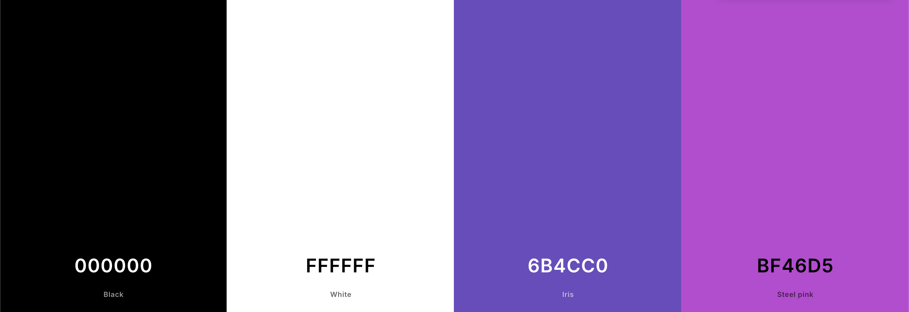 | 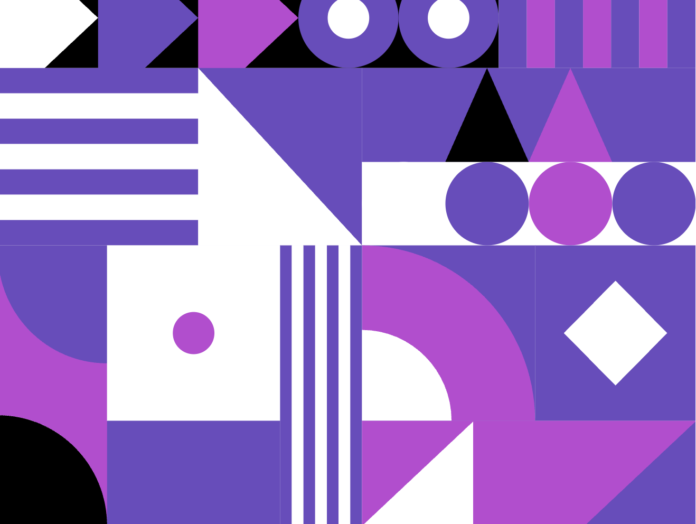 |

 <b>Font</b>

   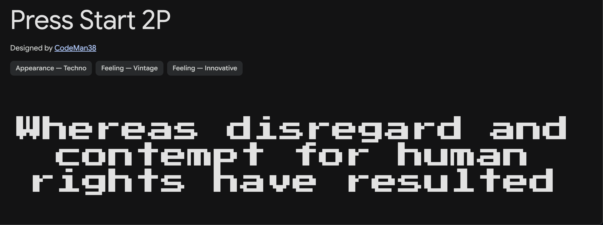 

---

## Games

### Game 1: Pac-Man in Space!
Developed & Designed by: Blaise 
Github link here!

<strong>Description</strong>

<strong>Pac-Man in Space!</strong> is a retro-inspired twist on the classic Pac-Man game, redesigned to fit a space arcade theme.  
Instead of the traditional ghosts, players must now evade Space Invader-style aliens across pixelated mazes set against galactic backgrounds. The game introduces new mechanics such as portals between levels, which not only increase the difficulty but also refresh the gameplay with new map layouts. To add a playful touch, a familiar sound effect from the Mario series is included as a humorous nod to classic gaming culture. This version keeps the core feel of Pac-Man while injecting it with creative, space-themed updates for a fun and nostalgic experience.

---

<strong>Assets & Tools</strong>

| **Tools**     | **Purpose**                                  |
|------------------|----------------------------------------------|
| Canva       | Designing visual elements and layouts      |
| Freesounds       | Sourcing free sound effects and music      |
| Gif Splitter       | Breaking GIFs into frames for animation      |

| **Languages**     | **Purpose**                                  |
|------------------|----------------------------------------------|
| HTML       | Structuring content for the games      |
| CSS       | Styling the UI and animations      |
| JavaScript       | Game logic, interactions, and functionality      |

---

  
<strong>How to Play!</strong>

Control Pac-Man using either the <b>Arrow keys</b> or <b>WASD</b> to move up, down, left, and right. Press the <b>spacebar</b> to start the game, and use it again to <b>pause</b> or <b>resume</b> during gameplay. 

On <b>Touch Devices</b>, swipe in any direction to move and tap once to start. A visible pause button allows you to stop the game at any time. While paused, you can choose to restart, resume, or toggle sound and music settings.

The objective is to collect all food pellets in the maze to clear the level. <b>Nuclear waste</b> grants bonus points, and <b>power-ups</b> temporarily scare the alien enemies, allowing you to eat them for extra score. Once all pellets are collected, find and collide with the <b>portal</b> to progress to the next level.

---

  
<strong>Wireframes</strong>

  | Desktop Lobby                    | Desktop Game                    | Mobile Lobby                    | Mobile Game                    |
  |----------------------------------|----------------------------------|----------------------------------|----------------------------------|
  | 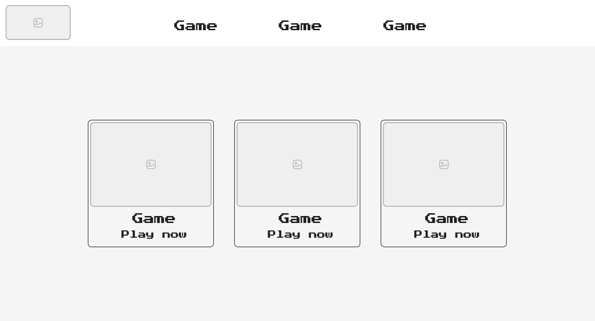 | 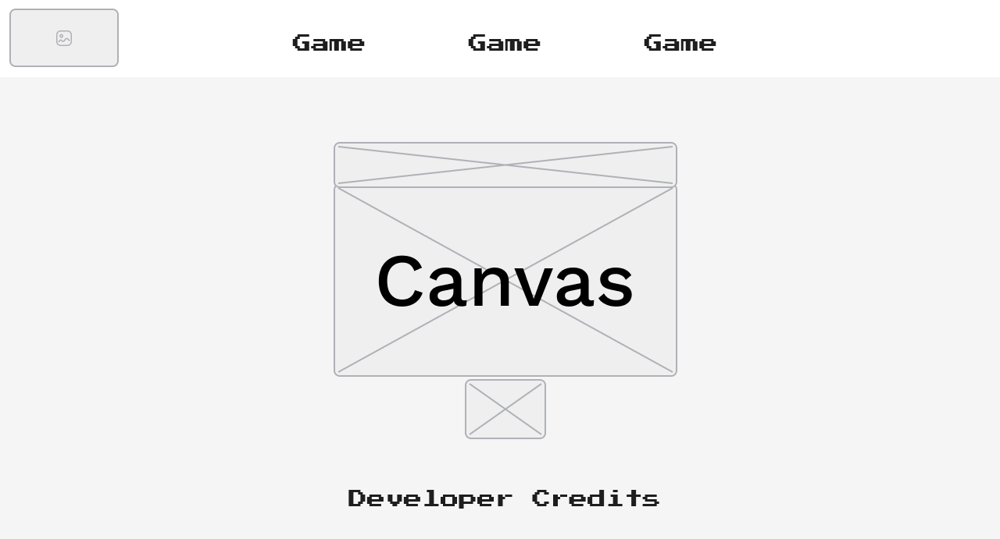 | 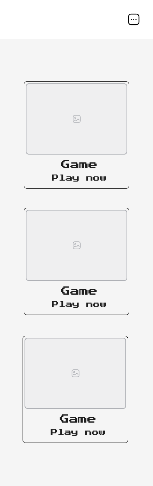 | 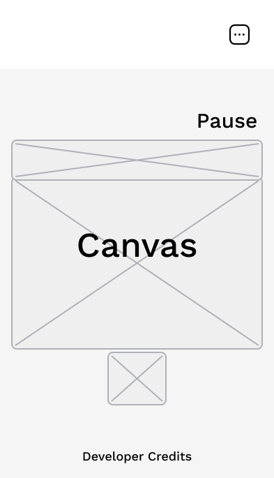 |

  | Map Layout 1                    | Map Layout 2                    | Map Layout 3                    |
  |----------------------------------|----------------------------------|----------------------------------|
  | 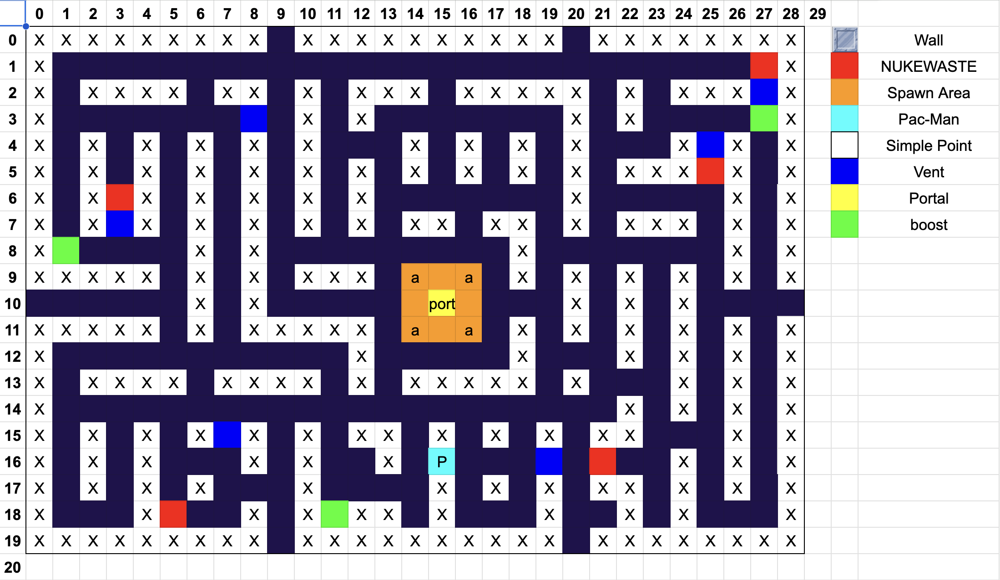 | 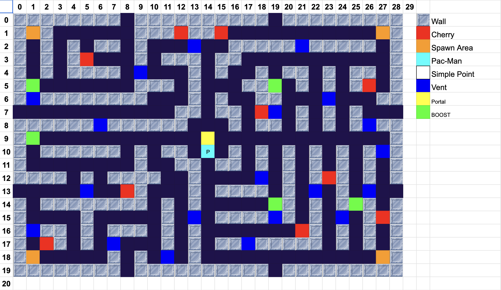 | 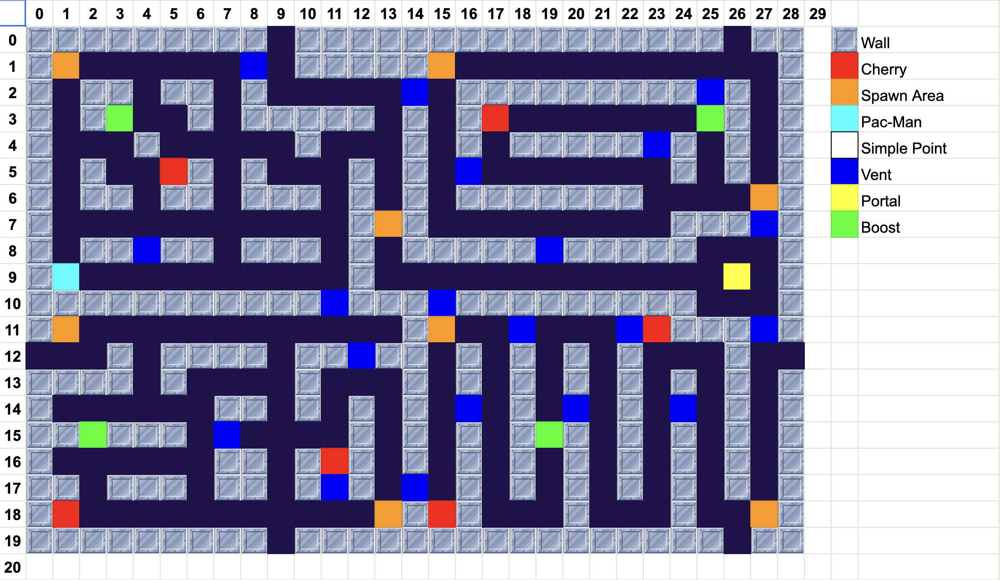 |

---

  
<strong>In-Game Features</strong>

  Aliens flee when power-up is collected
When Pac-Man eats a power-up, nearby alien enemies enter a frightened state and run away, allowing Pac-Man to temporarily chase and eat them.

 
Portal appears upon level completion
Once all food pellets are collected, a portal becomes visible on the map. Colliding with this portal transports the player to the next level.

 
Pac-Man teleports through tunnels
Moving through designated tunnels on the map teleports Pac-Man from one side of the maze to the other, maintaining continuous gameplay flow.

 
Pac-Man cannot pass through vents
Certain areas, like vents, act as solid obstacles that block Pac-Man’s movement, requiring the player to navigate around them.

 
Next movement direction is saved to avoid missed turns
When a player inputs a direction that cannot be immediately taken (e.g., blocked by a wall), the game remembers this input and executes the turn as soon as it becomes possible.

---

  
<strong>Screenshots</strong>

  | Start Game                    | In-Game                    |
  |----------------------------------|----------------------------------|
  | 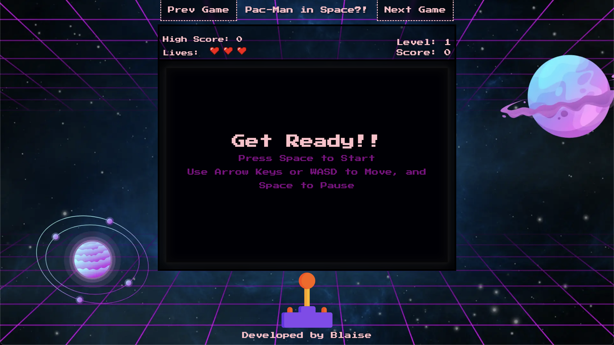 | 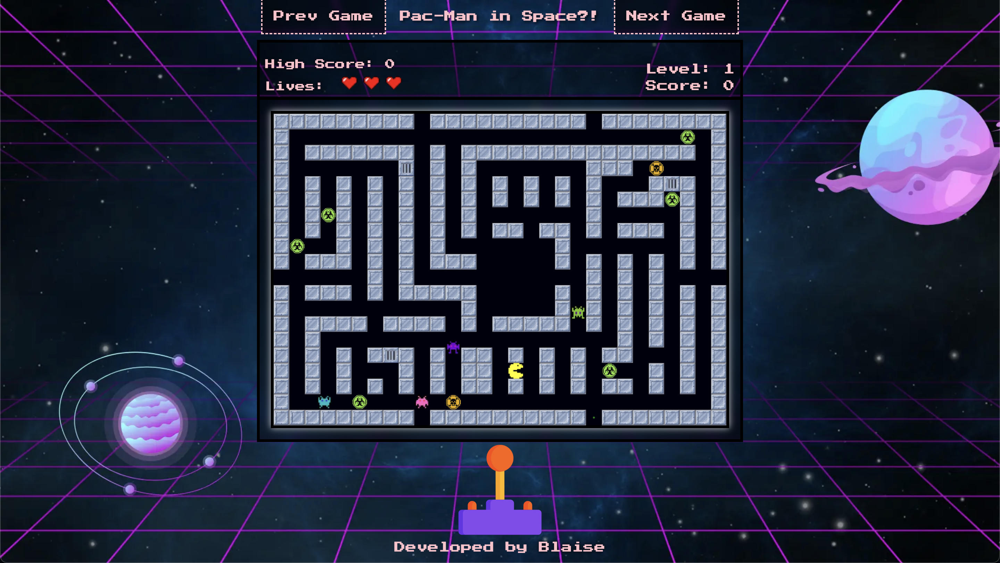 |

  | Paused Game                    | Game Over! 3                    |
  |----------------------------------|----------------------------------|
  | 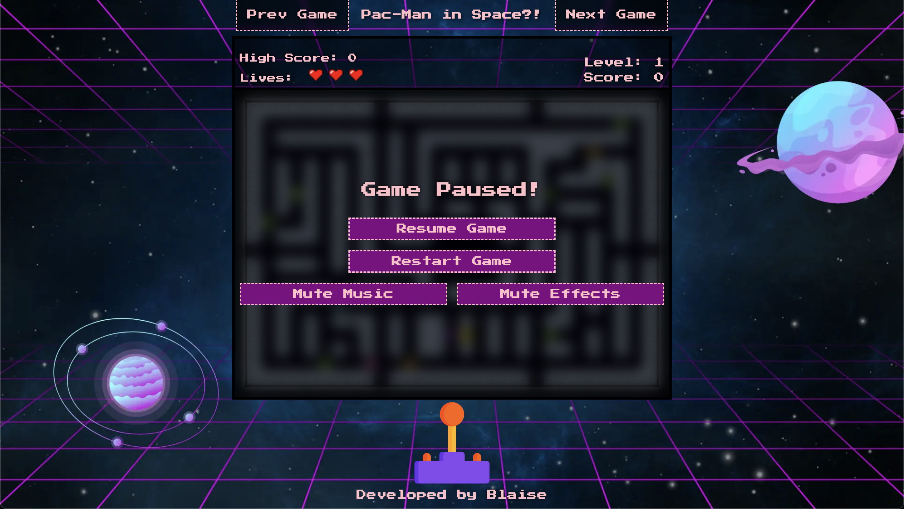 | 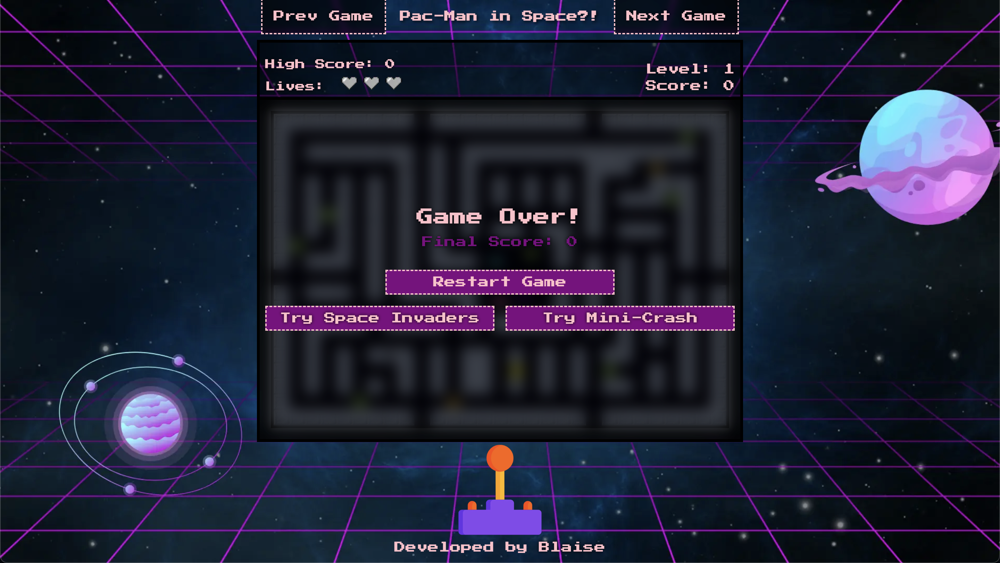 |

---

### Game 2: Space Invaders
Developed & Designed by: Rhys 
Github link here!

  
<strong>Description</strong>

  

<strong>Assets & Tools</strong>

  
<strong>How to Play!</strong>

  
<strong>In-Game Features</strong>

  
<strong>Screenshots</strong>

---

### Game 3: Mini Crash
Developed & Designed by: Hans 
Github link here!

  
<strong>Description</strong>

  

<strong>Assets & Tools</strong>

  
<strong>How to Play!</strong>

  
<strong>In-Game Features</strong>

  
<strong>Screenshots</strong>

---

## Team Collaboration

### Roles & Responsibilities

| Team Member | Role | Responsibilities |
|-------------|------|------------------|
| Blaise       | --- | ---- ---- ---- |
| Hans         | --- | ---- ---- ---- |
| Rhys       | --- | ---- ---- ---- |

### Progress Tracker

Project Board

---

## Deployment & Setup

---

## Testing

---

## Future Plans

---

### 