# 🎮 Group Project: Game Collection

## 📚 Table of Contents

1. [Overview](#overview)
2. [Planning](#planning)
3. [Games](#games)
    - [Game 1: Pac-Man in Space! - Developed my Blaise](#game-1-pac-man-in-space)
    - [Game 2: Space Invaders - Developed by Rhys](#game-2-space-invaders)
    - [Game 3: Mini Crash - Developed by Hans](#game-3-mini-crash)
4. [Team Collaboration](#team-collaboration)
5. [Deployment & Setup](#deployment--setup)
6. [Testing](#testing)
7. [Future Plans](#future-plans)
8. [Acknowledgements](#acknowledgements)

---

## Overview

[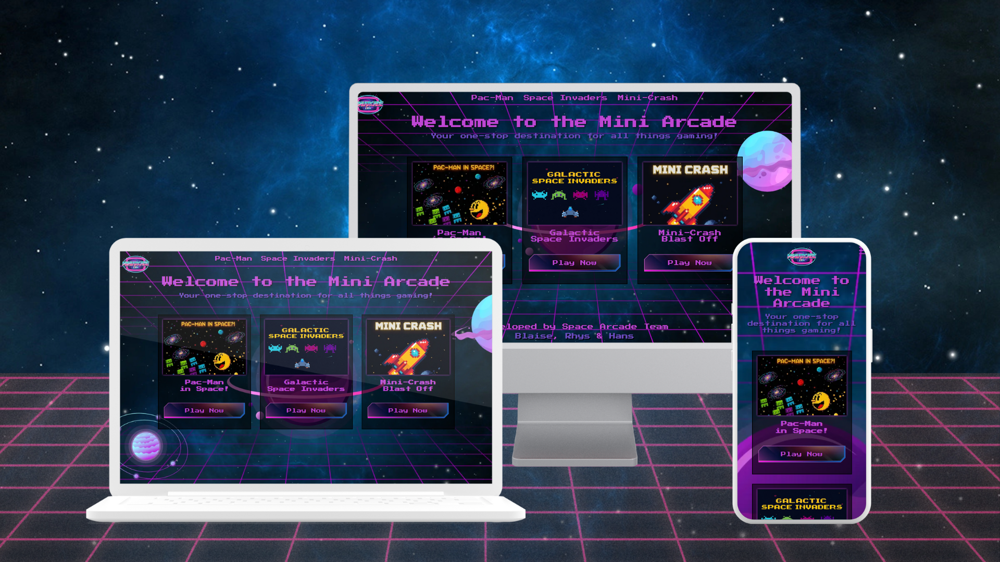](https://blaisesa.github.io/game-project/)

About The Project <br>
This group project is a collection of three retro-inspired arcade games, reimagined with modern features and collaborative design. Each game offering a unique experience. The main goal was to explore game development in a team environment while focusing on functionality, design, and player engagement.

[Live Project Link](https://blaisesa.github.io/game-project/)

Key Objectives:

1. Work collaboratively across design, development, and testing roles.

2. Learn and implement core game development principles.

3. Create engaging and visually appealing games using a shared theme.

4. Practice real-world project planning, version control, and documentation.

5. Develop skills in HTML, CSS, and JavaScript within a game context.  

6. Ensure cross-device compatibility and responsive design.

7. Test and debug games for a smooth user experience.

---

## Planning

We initially decided on an arcade-style theme to keep the project cohesive while allowing creative flexibility. The concept was to create three unique mini-games, each inspired by classic arcade titles but modernized with our own twists.

This structure allowed us to explore different game mechanics and design challenges within one unified project.

🤝 Team Strategy

To make the most of our individual strengths, we divided the work according to skill sets:

Each team member took ownership of one game, handling most of the development and design.

Shared responsibilities (such as UI styling, testing, or asset creation) were coordinated through regular meetings and collaborative tools.

We used GitHub Projects to track tasks, bugs, and progress throughout development.

This setup promoted independence while encouraging teamwork, review, and cross-support when needed.

<details>
<summary><b>Wireframes</b></summary>

| Desktop Lobby                                              | Desktop Game                                              | Mobile Lobby                                                       | Mobile Game                                                       |
| ---------------------------------------------------------- | --------------------------------------------------------- | ------------------------------------------------------------------ | ----------------------------------------------------------------- |
|  |  |  |  |

</details>

<details>
  <summary><strong>Resources Used</strong></summary>

| **Resource**   | **Purpose**                                  |
| -------------- | -------------------------------------------- |
| Excalidraw     | Creating wireframes and visual planning      |
| Image Resizers | Optimizing and resizing image assets         |
| Coolors        | Generating and organizing color palettes     |
| VS Code        | Writing and editing project source code      |
| Gemini & Canva | Designing UI elements and visual assets      |
| Freesounds     | Adding royalty-free sound effects and music  |
| CoPilot        | Assisting with code suggestions and snippets |

</details>

<details>
  <summary><b>Fonts & Colors</b></summary>

| Color Pallete                                            | Visualized colors                                            |
| -------------------------------------------------------- | ------------------------------------------------------------ |
|  |  |

<b>Font</b>


</details>

---

## Games

### Game 1: Pac-Man in Space!

Developed & Designed by: Blaise<br>
[View Github](https://github.com/blaisesa)

<strong>Description</strong>

<strong>Pac-Man in Space!</strong> is a retro-inspired twist on the classic Pac-Man game, redesigned to fit a space arcade theme. <br>
Instead of the traditional ghosts, players must now evade Space Invader-style aliens across pixelated mazes set against galactic backgrounds. The game introduces new mechanics such as portals between levels, which not only increase the difficulty but also refresh the gameplay with new map layouts. To add a playful touch, a familiar sound effect from the Mario series is included as a humorous nod to classic gaming culture. This version keeps the core feel of Pac-Man while injecting it with creative, space-themed updates for a fun and nostalgic experience.

---

<details>
<summary><strong>Assets & Tools</strong></summary>

| **Tools**    | **Purpose**                             |
| ------------ | --------------------------------------- |
| Canva        | Designing visual elements and layouts   |
| Freesounds   | Sourcing free sound effects and music   |
| Gif Splitter | Breaking GIFs into frames for animation |

| **Languages** | **Purpose**                                 |
| ------------- | ------------------------------------------- |
| HTML          | Structuring content for the games           |
| CSS           | Styling the UI and animations               |
| JavaScript    | Game logic, interactions, and functionality |

</details>

---

<details>
  <summary><strong>How to Play!</strong></summary>

Control Pac-Man using either the <b>Arrow keys</b> or <b>WASD</b> to move up, down, left, and right. Press the <b>spacebar</b> to start the game, and use it again to <b>pause</b> or <b>resume</b> during gameplay.

On <b>Touch Devices</b>, swipe in any direction to move and tap once to start. A visible pause button allows you to stop the game at any time. While paused, you can choose to restart, resume, or toggle sound and music settings.

The objective is to collect all food pellets in the maze to clear the level. <b>Nuclear waste</b> grants bonus points, and <b>power-ups</b> temporarily scare the alien enemies, allowing you to eat them for extra score. Once all pellets are collected, find and collide with the <b>portal</b> to progress to the next level.

</details>

---

<details>
  <summary><strong>Wireframes</strong></summary>

| Desktop Lobby                                              | Desktop Game                                              | Mobile Lobby                                                       | Mobile Game                                                       |
| ---------------------------------------------------------- | --------------------------------------------------------- | ------------------------------------------------------------------ | ----------------------------------------------------------------- |
|  |  |  |  |

| Map Layout 1                                   | Map Layout 2                                   | Map Layout 3                                   |
| ---------------------------------------------- | ---------------------------------------------- | ---------------------------------------------- |
|  |  |  |

</details>

---

<details>
  <summary><strong>In-Game Features</strong></summary>
  Aliens flee when power-up is collected
When Pac-Man eats a power-up, nearby alien enemies enter a frightened state and run away, allowing Pac-Man to temporarily chase and eat them.

    if (powerUpActive) {
            // Aliens move away from Pacman
            const dx = alien.x - pacman.x;
            const dy = alien.y - pacman.y;
            // Determine direction to move away
            if (Math.abs(dx) > Math.abs(dy)) {
                alien.updateDirection(dx > 0 ? "R" : "L");
            } else {
                alien.updateDirection(dy > 0 ? "D" : "U");
            }
          }

<br><br>
Portal appears upon level completion
Once all food pellets are collected, a portal becomes visible on the map. Colliding with this portal transports the player to the next level.

    function spawnPortal() {
      const portalTiles = 3; // 3x3 portal
      const map = levels[currentLevel];

      let portalRow = 0;
      let portalCol = 0;

    // Find the "p" tile in the current map
      for (let r = 0; r < rowCount; r++) {
        for (let c = 0; c < colCount; c++) {
            if (map[r][c] === "p") {
                portalRow = r;
                portalCol = c;
                break;
            }
        }
      }
    }

<br><br>
Pac-Man teleports through tunnels
Moving through designated tunnels on the map teleports Pac-Man from one side of the maze to the other, maintaining continuous gameplay flow.

    if (pacman.x <= 0) {
        pacman.x = boardWidth - pacman.width;
    } else if (pacman.x >= boardWidth - pacman.width) {
        pacman.x = 0;
    }
    if (pacman.y <= 0) {
        pacman.y = boardHeight - pacman.height;
    } else if (pacman.y + pacman.height >= boardHeight) {
        pacman.y = 0;
    }

<br><br>
Pac-Man cannot pass through vents, they act as solid obstacles that block Pac-Man’s movement, requiring the player to navigate around them.

    for (let vent of vents) {
        if (collision(pacman, vent)) {
            // Horizontal collision
            if (
                pacman.velocityX > 0 &&
                pacman.x + pacman.width > vent.x &&
                pacman.x < vent.x + vent.width
            ) {
                pacman.x = vent.x - pacman.width;
            } else if (
                pacman.velocityX < 0 &&
                pacman.x < vent.x + vent.width &&
                pacman.x + pacman.width > vent.x + vent.width
            ) {
                pacman.x = vent.x + vent.width;
            }

            // Vertical collision
            if (
                pacman.velocityY > 0 &&
                pacman.y + pacman.height > vent.y &&
                pacman.y < vent.y
            ) {
                pacman.y = vent.y - pacman.height;
            } else if (
                pacman.velocityY < 0 &&
                pacman.y < vent.y + vent.height &&
                pacman.y + pacman.height > vent.y + vent.height
            ) {
                pacman.y = vent.y + vent.height;
            }

            break; // Exit loop after handling collision
        }
    }

  <br><br>
  Mobile touch controls allow players to swipe in any direction to move Pac-Man accordingly. Defining touchstart and touchmove event listeners captures swipe gestures and translates them into movement commands. Ensured a 30px minimum swipe distance to prevent accidental movements.

    // Calculate swipe direction and move pacman accordingly
    function handleSwipe() {
    // Calculate differences in touch positions
    // Delta values represent the distance moved in each direction
    // Positive deltaX indicates a right swipe, negative indicates left
    const deltaX = touchEndX - touchStartX;
    const deltaY = touchEndY - touchStartY;

    // Minimum swipe distance threshold (pixels)
    // This prevents accidental small movements such as taps from triggering a direction change
    const threshold = 30;

    if (Math.abs(deltaX) > Math.abs(deltaY)) {
        // Horizontal swipe
        // Determine left or right swipe based on deltaX
        // If deltaX is positive, it's a right swipe; if negative, it's a left swipe
        if (deltaX > threshold) {
            pacman.updateDirection("R"); // Swipe right
            // Set next direction for smoother movement on mobile
            pacman.nextDirection = "R";
        } else if (deltaX < -threshold) {
            pacman.updateDirection("L"); // Swipe left
            // Set next direction for smoother movement on mobile
            pacman.nextDirection = "L";
        }
    } else {
        // Vertical swipe
        if (deltaY > threshold) {
            pacman.updateDirection("D"); // Swipe down
            // Set next direction for smoother movement on mobile
            pacman.nextDirection = "D";
        } else if (deltaY < -threshold) {
            pacman.updateDirection("U"); // Swipe up
            // Set next direction for smoother movement on mobile
            pacman.nextDirection = "U";
        }
    }
    }


</details>

---

<details>
  <summary><strong>Screenshots</strong></summary>

| Start Game                                               | In-Game                                            |
| -------------------------------------------------------- | -------------------------------------------------- |
|  |  |

| Paused Game                                                | Game Over!                                            |
| ---------------------------------------------------------- | ------------------------------------------------------ |
|  |  |

</details>

---

### Game 2: Galactic Space Invaders

Developed & Designed by: Rhys<br>

<details>
  <summary><strong>Description</strong></summary>
  Galactic Space Invaders is a game in which the player has to fight off a group of alien invaders in space

</details>

<details>
<summary><strong>Wireframe</strong></summary>
<b>Galactic Space Invaders Wireframe</b>

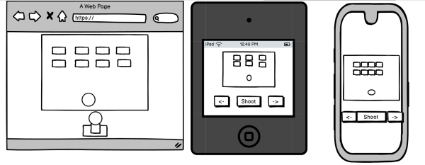

</details>

<details>
<summary><strong>Assets & Tools</strong></summary>

- <b>Languages:</b> HTML, CSS, JavaScript<br>
- <b>Version Control:</b> Github and Git<br>  
- <b>IDE:</b> VS Code<br>  
- <b>Tests:</b> Manual testing and chrome devTools,<br> 
- <b>Design Tools:</b> Figma (wireframe)
- <b>AI:</b> Copilot
</details>

<details>
  <summary><strong>How to Play!</strong></summary>

The player and move left and right with the arrow keys or with "a" and "d" keys and shoot with the spacebar. The player must kill all aliens before the reach the player or shoot the player 3 times. When the player kills all aliens the game is over.
</details>

<details>
  <summary><strong>In-Game Features</strong></summary>
1. The player character has 3 lives.
<br>
2. The player can move left and right, they can also shoot.
<br>
3. The player gets 100 pts for each alien they kill.
<br>
4. The aliens move left and right, when they hit a wall they move down.
<br>
5. The aliens randomly fire at the player.
<br>
6. The players score replaces the highscore if the score is higher then the current highscore.
</details>

<details>
  <summary><strong>Screenshots</strong></summary>
  Gameplay:

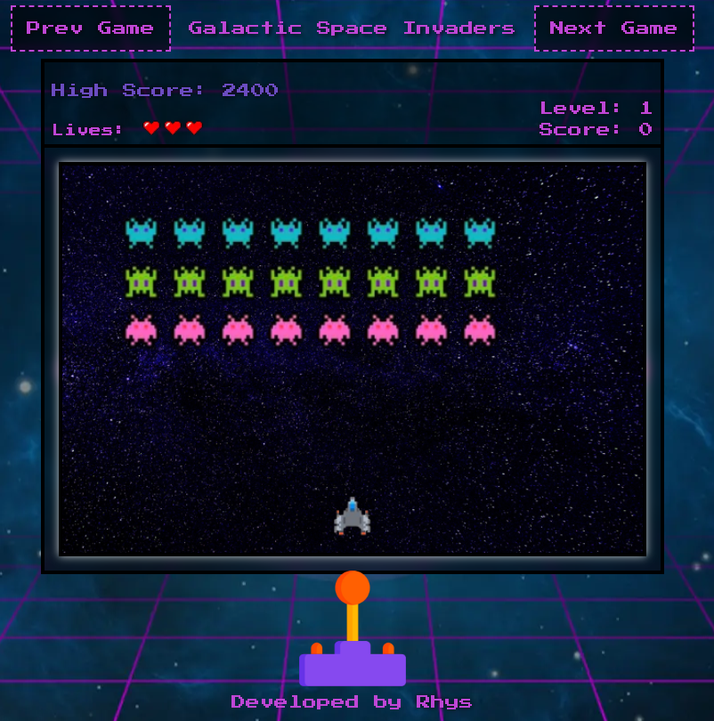

Win Screen:


Gameover screen:

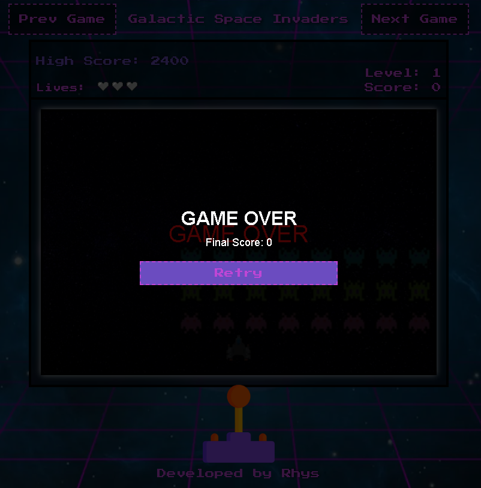

</details>

---

### Game 3: Mini Crash

Developed & Designed by: Hans<br>
[Github link here!](https://github.com/daswinkelmann)<br>

<b>Description</b><br>
Mini-Crash is a fast-paced multiplier game inspired by real-world “crash” titles seen in crypto and casino gaming.  
Players place a bet, watch the multiplier rise from 1.00x upward and must decide when to cash out before the crash happens!  
The aim is simple: hold your nerve to earn bigger rewards, but don’t wait too long… every second counts.


---

<details>
<summary> <b>Assets & Tools</b></summary>
- <b>Languages:</b> HTML5, CSS3, JavaScript (ES6)<br>
- <b>IDE:</b> Visual Studio Code<br>  
- <b>Version Control:</b> Git & GitHub<br>  
- <b>Design Tools:</b> Figma (wireframe) and Canva (UI mockups)<br>  
- <b>Game Logic:</b> Custom JavaScript loop controlling multiplier growth and random crash event<br>  
- <b>Testing:</b> Chrome DevTools console, manual playtesting, and peer feedback<br>  
</details>

---

<details>
<summary> <b>How to Play!</b></summary>
1. Click Start Game to begin a new round.<br>  
2. Watch the multiplier rise in real time — starting from 1.00x.<br>  
3. Click Cash Out at any time to lock in your winnings.<br>  
4. If the multiplier crashes before you cash out, you lose your bet.<br>  
5. After each round, the game automatically resets for another try.<br><br>

_Tip:_ The multiplier can reach up to 25x — but most rounds crash much earlier. Timing and luck are key!

</details>

---

<details>
<summary> <b>In-Game Features</b></summary>
- Dynamic multiplier animation rising in real time<br>  
- Randomised crash point for unpredictability<br>  
- Responsive buttons for Start and Cash-Out<br>  
- Round-end delay with reset to encourage replay<br>  
- Clean UI with visual feedback and game messages (e.g. “Crashed!” or “You Won!”)<br>  
- Console logging for testing and debugging<br>  
</details>

---

<details>
<summary> <b>Future Improvements</b></summary>
Planned updates and enhancements for future versions include:<br>
- Bet Controls: Add adjustable bet amount and winnings display for a more realistic experience.<br>  
- Advanced Randomised Probability: Improve the crash algorithm to include probability weighting for more varied rounds.<br>  
- Help Screen: Provide an accessible info overlay explaining game rules and controls.<br>  
- Audio Feedback: Add background music and sound effects for Start, Cash Out, and Crash events to increase immersion.<br>  
</details>

---

<details>
<summary> <b>Screenshots</b></summary>
(Insert your images here once uploaded to the repo, e.g.)<br>  
`/assets/images/mini-crash-start.png`<br>  
`/assets/images/mini-crash-win.png`<br>  
`/assets/images/mini-crash-crashed.png`<br>
</details>

---

## Team Collaboration

### Roles & Responsibilities

| Team Member | Role                      | Responsibilities                                                                                                                               |
| ----------- | ------------------------- | ---------------------------------------------------------------------------------------------------------------------------------------------- |
| **Blaise**  | Team Lead                 | Lead for **Pac-Man**, managed overall project coordination, ensured team progress, and contributed to HTML, CSS, and JavaScript for all games. |
| **Rhys**    | Developer & Tester        | Lead for **Space Invaders**, responsible for gameplay implementation, testing, and supported HTML, CSS, and JavaScript across all games.       |
| **Hans**    | Game Designer & Developer | Lead for **Mini-Crash**, responsible for core game logic, UI design, and contributed to HTML, CSS, and JavaScript across all games.            |

_All team members collaborated closely on coding, testing, and design decisions to ensure consistency and quality across the three mini-games._

### Progress Tracker

After initial planning, we set up a GitHub Project board to manage tasks, track progress, and facilitate collaboration. Each team member created issues for their assigned tasks, which were then organized with their labels.

[View the Project Board](https://github.com/users/Blaisesa/projects/5)

---

## Deployment & Setup

The project is hosted on GitHub Pages for easy access and sharing.
<br>
If you wish to run the project locally, follow these steps:
1. Fork or clone the repository from GitHub:
   ```bash
   git clone https://github.com/blaisesa/game-project.git
   ```
2. Navigate to the project directory:
   ```bash
   cd game-project
   ```
3. Open the `index.html` file in your preferred web browser to start playing the games.

Enjoy the games!

---

## Testing

Testing was conducted throughout the development process to ensure the game functions as intended. Key testing methods included:

- **Unit Testing:** Individual functions and components were tested in isolation to verify their behavior.
- **Integration Testing:** The interaction between different components (e.g., player movement, collision detection) was tested to ensure they work together seamlessly.
- **User Testing:** Playtesting sessions were held with team members and external users to gather feedback on gameplay, controls, and overall experience.

Bugs and issues identified during testing were logged in GitHub Issues and addressed in subsequent development sprints.

- **Cross-Browser Testing:** The games were tested on multiple browsers (Chrome, Firefox, Safari) to ensure compatibility and consistent performance.
- **Responsive Testing:** The games were tested on various devices (desktop, tablet, mobile) to ensure a smooth experience across different screen sizes.
- **Autoprefixer:** Used to ensure CSS compatibility across different browsers.
- **HTML & CSS Validation:** The code was validated using the W3C Markup Validation Service to ensure adherence to web standards.

**HTML and CSS Validation results:**
- no errors found in HTML files.
- no errors found in CSS files.

| Lobby HTML                                   | Pac-Man HTML                                   | Mini-Crash HTML                               | Space Invaders HTML                           |
| ---------------------------------------------- | ---------------------------------------------- | ---------------------------------------------- | ---------------------------------------------- |
| 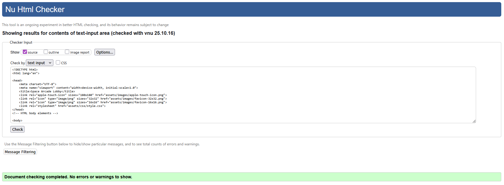 | 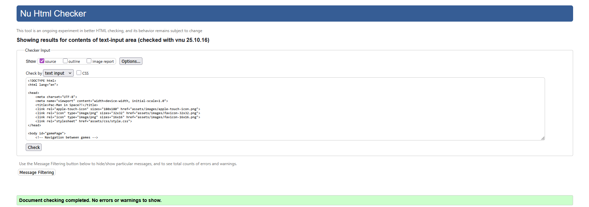 | 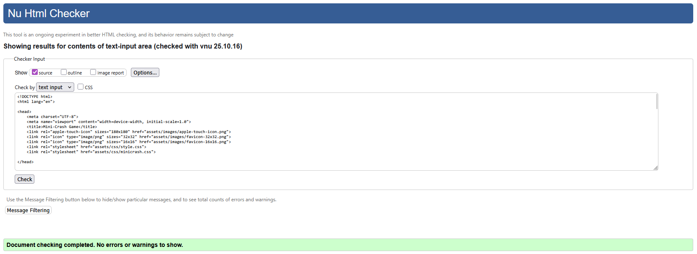 | 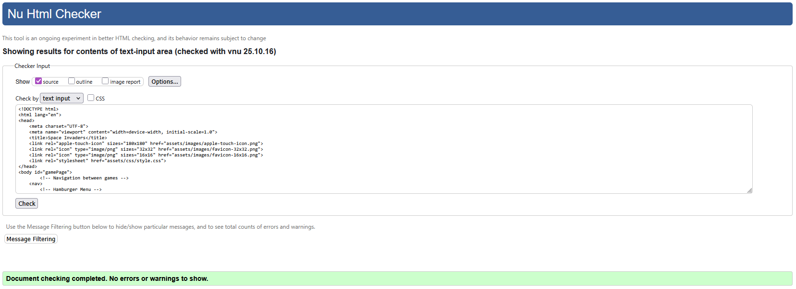 |

CSS Validation Results:
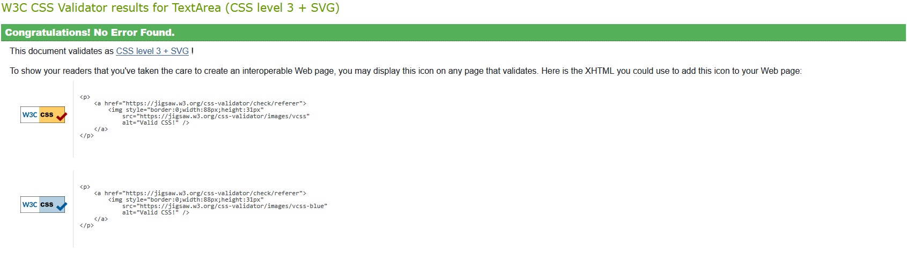

**Lighthouse Reports:**
| Desktop Report                                      | Mobile Report                                       |
| --------------------------------------------------- | --------------------------------------------------- |
| 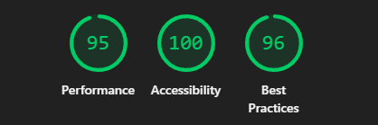 | 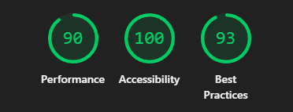 |

---

## Future Plans

There are several ways to enhance and expand the project in future iterations:
1. **Additional Games:** Introduce more mini-games to the collection, each with unique mechanics and themes.
2. **Multiplayer Functionality:** Implement multiplayer modes for competitive or cooperative gameplay.
3. **User Accounts & Leaderboards:** Allow players to create accounts, save progress, and compete on global leaderboards.
4. **Enhanced Graphics & Sound:** Upgrade visual and audio assets for a more immersive experience.
5. **Cross game rewards and easter eggs:** Implement rewards that carry over between games and hidden features for players to discover.

## Acknowledgements
We would like to extend our gratitude to Code Institute for providing the resources and support necessary to complete this project. Special thanks to our mentors and peers for their valuable feedback and encouragement throughout the development process.